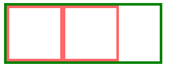

## 概念

`BFC` 全称是 `Block Formatting Context`，即块格式化上下文。它是CSS2.1规范定义的，关于CSS渲染定位的一个概念。
要明白BFC到底是什么，首先来看看什么是视觉格式化模型。

**视觉格式化模型**

视觉格式化模型(visual formatting model)是用来处理文档并将它显示在视觉媒体上的机制，它也是CSS中的一个概念。
视觉格式化模型定义了盒（Box）的生成，盒主要包括了块盒、行内盒、匿名盒（没有名字不能被选择器选中的盒）以及一些实验性的盒（未来可能添加到规范中）。
盒的类型由display属性决定。

匿名盒（anonymous box）也有份匿名块盒与匿名行内盒，因为匿名盒没有名字，不能利用选择器来选择它们，所以它们的所有属性都为inherit或初始默认值

```html
<div>
    Some inline text
    <p>followed by a paragraph</p>
    followed by more inline text.
</div>
```


块格式上下文是页面CSS 视觉渲染的一部分，用于决定块盒子的布局及浮动相互影响范围的一个区域

## 创建方法

- 根元素或其它包含它的元素
- 浮动 (元素的 `float` 不为 `none`)
- 绝对定位元素 (元素的 `position` 为 `absolute` 或 `fixed`)
- 行内块`inline-blocks`(元素的 `display: inline-block`)
- 表格单元格(元素的`display: table-cell`，HTML表格单元格默认属性)
- `overflow` 的值不为 `visible` 的元素
- 弹性盒`flex boxes` (元素的`display: flex` 或 `inline-flex`)

## BFC的范围

```html
<!--  这段代码表示，#div_1创建了一个块格式上下文，这个上下文包括了#div_2、#div_3、#div_4、#div_5。
      即#div_2中的子元素也属于#div_1所创建的BFC。
      但由于#div_5创建了新的BFC，所以#div_6和#div_7就被排除在外层的BFC之外  -->

<div id='div_1' class='BFC'>
    <div id='div_2'>
        <div id='div_3'></div>
        <div id='div_4'></div>
    </div>
    <div id='div_5' class='BFC'>
        <div id='div_6'></div>
        <div id='div_7'></div>
    </div>
</div>
```

## BFC的效果

BFC的最显著的效果就是建立一个隔离的空间，断绝空间内外元素间相互的作用

简单归纳一下：

- 内部的盒会在垂直方向一个接一个排列（可以看作BFC中有一个的常规流）；
- 处于同一个BFC中的元素相互影响，可能会发生margin collapse；
- 每个元素的margin box的左边，与容器块border box的左边相接触(对于从左往右的格式化，否则相反)。即使存在浮动也是如此；
- BFC就是页面上的一个隔离的独立容器，容器里面的子元素不会影响到外面的元素，反之亦然；
- 计算BFC的高度时，考虑BFC所包含的所有元素，连浮动元素也参与计算；
- 浮动盒区域不叠加到BFC上；

这么多性质有点难以理解，但可以作如下推理来帮助理解：html的根元素就是`<html>`，而根元素会创建一个BFC，
创建一个新的BFC时就相当于在这个元素内部创建一个新的`<html>`，子元素的定位就如同在一个新`<html>`页面中那样，
而这个新旧html页面之间时不会相互影响的。

## 从实际代码来分析BFC

### 实例1

```html
<style>
    * {
        margin: 0;
        padding: 0;
    }
    .left{
        background: #73DE80;    /* 绿色 */
        opacity: 0.5;
        border: 3px solid #F31264;
        width: 200px;
        height: 200px;
        float: left;
    }
    .right{                        /* 粉色 */
        background: #EF5BE2;
        opacity: 0.5;
        border: 3px solid #F31264;
        width:400px;
        min-height: 100px;
    }
    .box{
        background:#888;
        height: 100%;
        margin-left: 50px;
    }
</style>
<div class='box'>
    <div class='left'> </div>
    <div class='right'> </div>
</div>
```


绿色框（'#left'）向左浮动，它创建了一个新BFC，但暂时不讨论它所创建的BFC。由于绿色框浮动了，它脱离了原本normal flow的位置，
因此，粉色框（'#right'）就被定位到灰色父元素的左上角（特性3：元素左边与容器左边相接触），与浮动绿色框发生了重叠。
同时，由于灰色框（'#box'）并没有创建BFC，因此在计算高度的时候，并没有考虑绿色框的区域（特性6：浮动区域不叠加到BFC区域上），
发生了高度坍塌，这也是常见问题之一。

### 实例2

```html
.BFC{
    overflow: hidden;
}

<div class='box BFC'>
    <div class='left'> </div>
    <div class='right'> </div>
</div>
```


灰色框创建了一个新的BFC后，高度发生了变化，计算高度时它将绿色框区域也考虑进去了（特性5：计算BFC的高度时，浮动元素也参与计算）

### 实例3

```html
<style>
    .little{
        background: #fff;
        width: 50px;
        height: 50px;
        margin: 10px;
        float: left;
    }
</style>

<div class='box BFC'>
    <div class='left'> </div>
    <div class='right'>
        <div class='little'></div>
        <div class='little'></div>
        <div class='little'></div>
    </div>
</div>
```


由于粉色框没有创建新的BFC，因此粉色框中白色块受到了绿色框的影响，被挤到了右边去了。先不管这个，看看白色块的margin

### 实例4

```html
<div class='box BFC'>
    <div class='left'> </div>
    <div class='right BFC'>
        <div class='little'></div>
        <div class='little'></div>
        <div class='little'></div>
    </div>
</div>
```


一旦粉色框创建了新的BFC以后，粉色框就不与绿色浮动框发生重叠了，
同时内部的白色块处于隔离的空间（特性4：BFC就是页面上的一个隔离的独立容器），白色块也不会受到绿色浮动框的挤压

## 应用案例

### 不和浮动元素重叠

```html
<style>
    body {
        width: 300px;
    }
    .aside {
        width: 100px;
        height: 150px;
        float: left;
        background: red;
    }
    .main {
        height: 200px;
        background: green;
        overflow: hidden;  /* 触发main生成BFC */
    }
</style>

<body>
    <div class="aside"></div>
    <div class="main"></div>
</body>
```


### 清除元素内部浮动

```html
<style>
    .par {
        border: 5px solid green;
        width: 300px;
        overflow: hidden;
    }
    .child {
        border: 5px solid #f66;
        width: 100px;
        height: 100px;
        float: left;
    }
</style>

<div class="par">
    <div class="child"></div>
    <div class="child"></div>
</div>
```



### 防止垂直margin重叠

```html
<style>
    p {
        background: #fcc;
        width: 200px;
        line-height: 100px;
        text-align: center;
        margin: 50px;
    }
    
    .BFC {
        overflow: hidden;
    }
</style>

<p>你好</p>
<div class="BFC">
    <p>世界</p>
</div>
```


