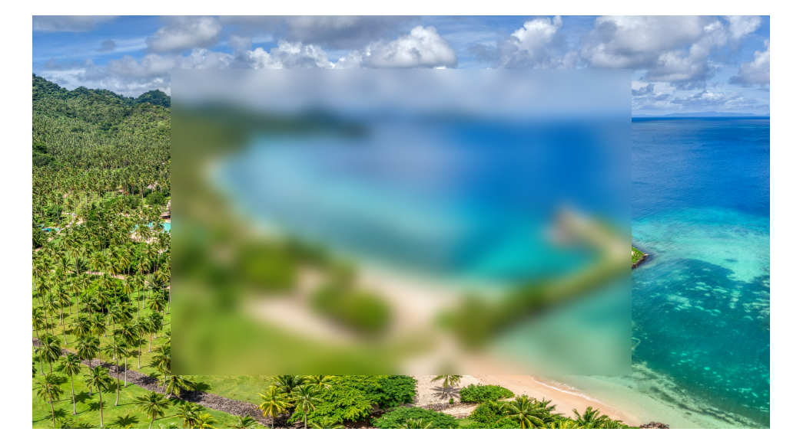
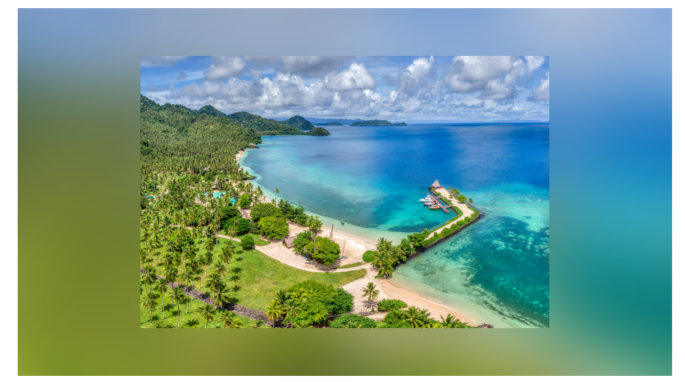

## filter

filter 属性定义了元素(通常是``)的可视效果(例如：模糊与饱和度)

```css
img {   
    filter: blur(5px);
    filter: brightness(200%);
    filter: contrast(200%);
    filter: drop-shadow(8px 8px 10px red); /* 设置阴影效果*/
    filter: grayscale(50%);
    filter: hue-rotate(90deg);
    filter: invert(100%);
    filter: opacity(30%);
    filter: saturate(800%);
    filter: sepia(100%); /* 将图像转换为深褐色 */

    /* 使用多个滤镜 */
    filter: contrast(200%) brightness(150%);
}
```

## backdrop-filter

`filter` 是将效果用于元素自身，而 `backdrop-filter` 则是将效果用于元素的背景

为了看到效果，必须使元素或其背景至少部分透明

## 案列1



```html
<div class="wrapper">
	<div class="box"></div>
</div>
```

```css
.wrapper {
    width: 960px;
    height: 540px;
    background-image: url(./wallhaven-jxwpdp.jpg);
    background-repeat: no-repeat;
    background-size: cover;
    margin: 50px auto;
    display: flex;
    align-items: center;
    justify-content: center;
}
.box {
    width: 600px;
    height: 400px;
    backdrop-filter: blur(10px);
}
```

## 案例2



```html
<div class="wrapper">
	
</div>
```

```css
.wrapper {
    width: 960px;
    height: 540px;
    background-image: url(./wallhaven-jxwpdp.jpg);
    background-repeat: no-repeat;
    background-size: cover;
    margin: 50px auto;

    display: flex;
    align-items: center;
    justify-content: center;

    position: relative;
}
.wrapper::after {
    content: "";
    position: absolute;
    left: 0;
    top: 0;
    z-index: 0;
    width: 100%;
    height: 100%;
    backdrop-filter: blur(50px);
}
.img {
    width: 600px;
    height: 400px;
    position: relative;
    z-index: 1;
}
```
