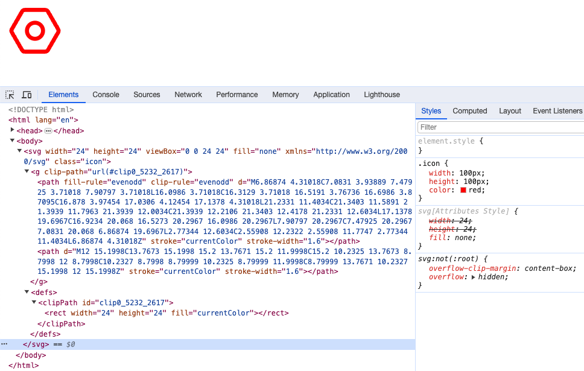
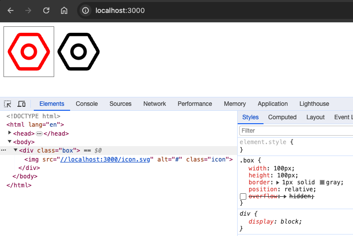
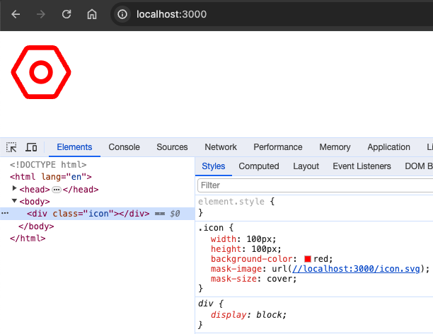

先给出svg代码，后面都是用这个图标，代码相同

```xml{5,7,11}
<svg width="24" height="24" viewBox="0 0 24 24" fill="none" xmlns="http://www.w3.org/2000/svg">
    <g clip-path="url(#clip0_5232_2617)">
        <path fill-rule="evenodd" clip-rule="evenodd"
              d="M6.86874 4.31018C7.0831 3.93889 7.47925 3.71018 7.90797 3.71018L16.0986 3.71018C16.3129 3.71018 16.5191 3.76736 16.6986 3.87095C16.878 3.97454 17.0306 4.12454 17.1378 4.31018L21.2331 11.4034C21.3403 11.5891 21.3939 11.7963 21.3939 12.0034C21.3939 12.2106 21.3403 12.4178 21.2331 12.6034L17.1378 19.6967C16.9234 20.068 16.5273 20.2967 16.0986 20.2967L7.90797 20.2967C7.47925 20.2967 7.0831 20.068 6.86874 19.6967L2.77344 12.6034C2.55908 12.2322 2.55908 11.7747 2.77344 11.4034L6.86874 4.31018Z"
              stroke="currentColor" stroke-width="1.6"/>
        <path d="M12 15.1998C13.7673 15.1998 15.2 13.7671 15.2 11.9998C15.2 10.2325 13.7673 8.7998 12 8.7998C10.2327 8.7998 8.79999 10.2325 8.79999 11.9998C8.79999 13.7671 10.2327 15.1998 12 15.1998Z"
              stroke="currentColor" stroke-width="1.6"/>
    </g>
    <defs>
        <clipPath id="clip0_5232_2617">
            <rect width="24" height="24" fill="currentColor"/>
        </clipPath>
    </defs>
</svg>
```

## 内联svg

就是在代码中嵌入svg源码，然后它的路径一般是用 `stoke` 或者 `fill` 生成，需要改成 `currentColor`
注意上面svg代码的高亮部分 `stroke="currentColor"`,  `fill="currentColor"`，然后我们在代码中可以给它设置`color`



## SVG作为图片源

svg抽离出一个单独的文件，作为外链这时设置color无效，

核心代码 `filter: drop-shadow(-100px 0px 0px red);` 会生成和svg形状相同的影子(shadow)，位置在 ***{x: -100px, y:0}***

那么剩下的事，我们原本的svg(黑色)移出视区，就大功告成了



附上完整代码

```html
<!DOCTYPE html>
<html lang="en">
<head>
	<meta charset="UTF-8">
	<meta name="viewport" content="width=device-width, initial-scale=1.0">
	<title>Document</title>
	<style>
		.box {
			width: 100px;
			height: 100px;
			border: 1px solid gray;
			position: relative;
			overflow: hidden;
		}

		.icon {
			width: 100%;
			height: 100%;
			position: absolute;
			left: 100px;
			filter: drop-shadow(-100px 0px 0px red);
		}
	</style>
</head>
<body>
<div class="box">
	
</div>
</body>
</html>
```

## svg作为背景图片使用



## 总结

以上是目前可以实现svg变色的3种方案，但是只能处理单一颜色，如果svg是个多色图标，就力不从心得寻求其他方案了

需要注意的是对于svg外链，一定要正确设置它的 `Content-Type: image/svg+xml`，并且源码中不能写死颜色
