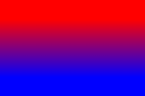
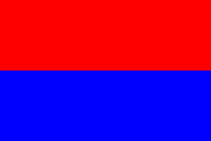
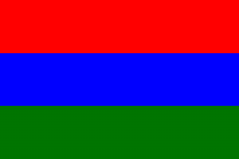
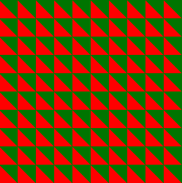
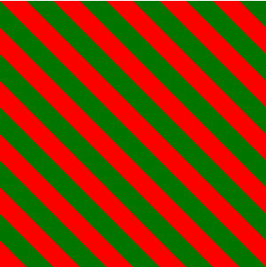

# linear-gradient

## 基本语法

```css
.box {
    background: linear-gradient(red 20%, blue 80%);
    width: 300px;
    height: 200px;
}
```



div顶部的20%的区域会被填充为red，底部20%的区域会被填充为blue，而剩余的60%的区域会有渐变效果，也就是说，两个色标被拉近了

```css
.box {
    background: linear-gradient(red 50%, blue 50%);
    width: 300px;
    height: 200px;
}
```

那如果把两个色标重合到一起，它会变成这样



> If multiple color-stops have the same position, they produce an infinitesimal transition from 
> the one specified first in the rule to the one specified last. In effect, the color suddenly changes 
> at that position rather than smoothly transitioning.
（如果多个色标拥有相同的位置，它们之间会产生一个无限小的过度区域，过度的起止颜色分别是第一个和最后一个指定值。
> 从效果上看，颜色会在指定的位置突然变化，而不是一个平滑的渐变过程）

```css
.box {
    background: linear-gradient(red 33.3%, blue 33.3%, blue 66.6%, green 66.6%);
    width: 300px;
    height: 200px;
}
```

同样的原理，如果要创建超过两种颜色的条纹，也非常容易，它的效果是这样的：



## 其他写法

> If a color-stop has a position that is less than the specified position of any color-stop 
> before it in the list, set its position to be equal to the largest specified position of 
> any color-stop before it.
（如果某个色标的位置值要比整个列表中在它之前的色标的位置值都要小，则该色标的位置值会被设置为它前面所有色标位置值的最大值）

这意味着如果把第二个色标的位置值设置为0，那么它的位置就总会被调整为前一个色标的位置值。也就是说这两种写法实现的效果是一样的：

```css
.box {
    // 两色条纹
    background: linear-gradient(red 50%, blue 50%); 
    // 三色
    background: linear-gradient(red 33.3%, blue 0, blue 66.6%, green 0); 
}
```

## 斜向条纹

如果直接修改渐变方向，使其倾斜45°，效果如下：



```css
.box {
    width: 300px;
    height: 300px;
    background: linear-gradient(45deg, red 50%, green 0);
    background-size: 30px 30px;
}
```

但是我们需要的效果是把整个背景旋转45°，而不是把每个小切片旋转45°。仔细观察会发现，想要通过小切片拼接成完整的斜向条纹，
只需将每个切片分割为四份。因此需要新增两个色标

```css
.box {
    width: 300px;
    height: 300px;
    background: linear-gradient(45deg, 
        red 25%, 
        green 0, green 50%, 
        red 0, red 75%, 
        green 0
    );
    background-size: 60px 60px;
}
```

效果如下：


