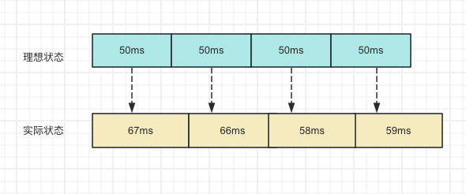
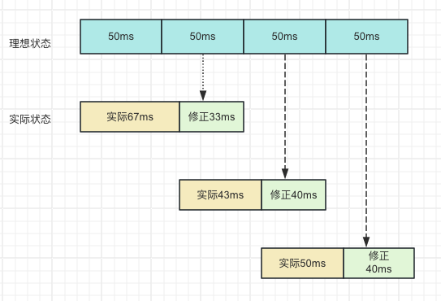

## 背景

setTimeout 是***不准的***。因为 setTimeout 是一个宏任务，它的指定时间指的是：***进入主线程的时间***。
所以什么时候可以执行 callback，需要看 ***主线程前面还有多少任务待执行***。
由此，才有了这个问题。

运行代码如下，通过一个计数器来记录每一次 setTimeout 的调用，而设定的间隔 * 计数次数，就等于理想状态下的延迟，通过以下例子来查看我们计时器的准确性

```js
function timer() {
	let speed = 50;  // 设定间隔
	let counter = 1; // 计数
	let start = new Date().getTime();

	function instance() {
		let ideal = counter * speed;                // 记录理想值
		let real = new Date().getTime() - start;  // 记录真实值
		counter++;
		let diff = real - ideal;  // 差值
		console.log(`第一次${counter - 1}执行，理想值为${ideal}，实际值为${real}，差值是${diff}`)

		setTimeout(function () {
			instance();
		}, speed);
	}

	setTimeout(function () {
		instance();
	}, speed);
}

timer();
```

而我们如果在 setTimeout 还未执行期间加入一些额外的代码逻辑，再来看看这个差值。

```js
setTimeout(function() { instance(); }, speed);
for(var x=1, i=0; i<10000000; i++) { 
	x *= (i + 1); 
}
```

可以看出，这大大加剧了误差。 可以看到随着时间的推移， setTimeout 实际执行的时间和理想的时间差值会越来越大，这就不是我们预期的样子。
类比真实的场景，对于一些倒计时以及动画来说都会造成时间的偏差都是不理想的。

## 如何实现准时的 “setTimeout”

::: tip
`window.requestAnimationFrame()` 告诉浏览器——你希望执行一个动画，并且要求浏览器在下次重绘之前调用指定的回调函数更新动画。
:::

该方法需要传入一个回调函数作为参数，该回调函数会在浏览器下一次重绘之前执行，回调函数执行次数通常是每秒60次，也就是每16.7ms 执行一次，
但是并不一定保证为 16.7 ms。 我们也可以尝试一下将它来模拟 setTimeout。

```js
function mockSetTimeout(cb, delay) {
	let startTime = Date.now()
	loop()

	function loop() {
		const now = Date.now()
		if (now - startTime >= delay) {
			cb();
			return;
		}
		requestAnimationFrame(loop)
	}
}

mockSetTimeout();
```

发现由于 16.7 ms 间隔执行，在使用间隔很小的定时器，很容易导致时间的不准确。因此这种方案仍然不是一种好的方案。

## while

想得到准确的，我们第一反应就是如果我们能够主动去触发，获取到最开始的时间，以及不断去轮询当前时间，
如果差值是预期的时间，那么这个定时器肯定是准确的，那么用 while 可以实现这个功能。

```js
function timer(time) {
	const startTime = Date.now();
	while (true) {
		const now = Date.now();
		if (now - startTime >= time) {
			console.log('误差', now - startTime - time);
			return;
		}
	}
}

timer(5000); 
```
显然这样的方式很精确，但是我们知道 js 是单线程运行，使用这样的方式强行霸占线程会使得页面进入卡死状态，这样的结果显然是不合适的。

## setTimeout 系统时间补偿

原方案



setTimeout系统时间补偿，当每一次定时器执行时后，都去获取系统的时间来进行修正，虽然每次运行可能会有误差，
但是通过系统时间对每次运行的修复，能够让后面每一次时间都得到一个补偿。



```js
function timer() {
	let speed = 50;
	let counter = 1;
	let start = new Date().getTime();

	function instance() {
		let ideal = counter * speed;
		let real = new Date().getTime() - start;
		counter++;
		let diff = real - ideal;
		console.log(`第${counter}次执行，${real} - ${ideal} = ${diff}`);
		setTimeout(function () {
			instance();
		}, (speed - diff)); // 通过系统时间进行修复
	}

	setTimeout(function () {
		instance();
	}, speed);
}

timer();
```
