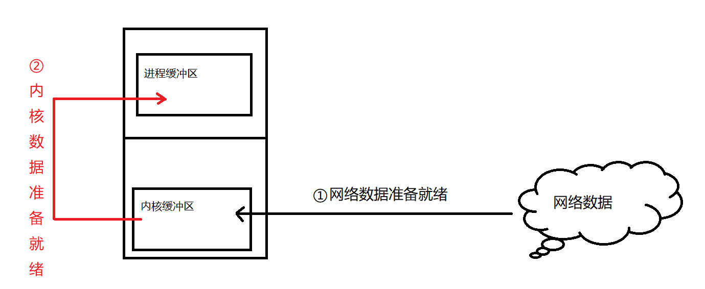
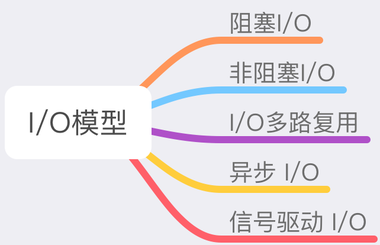
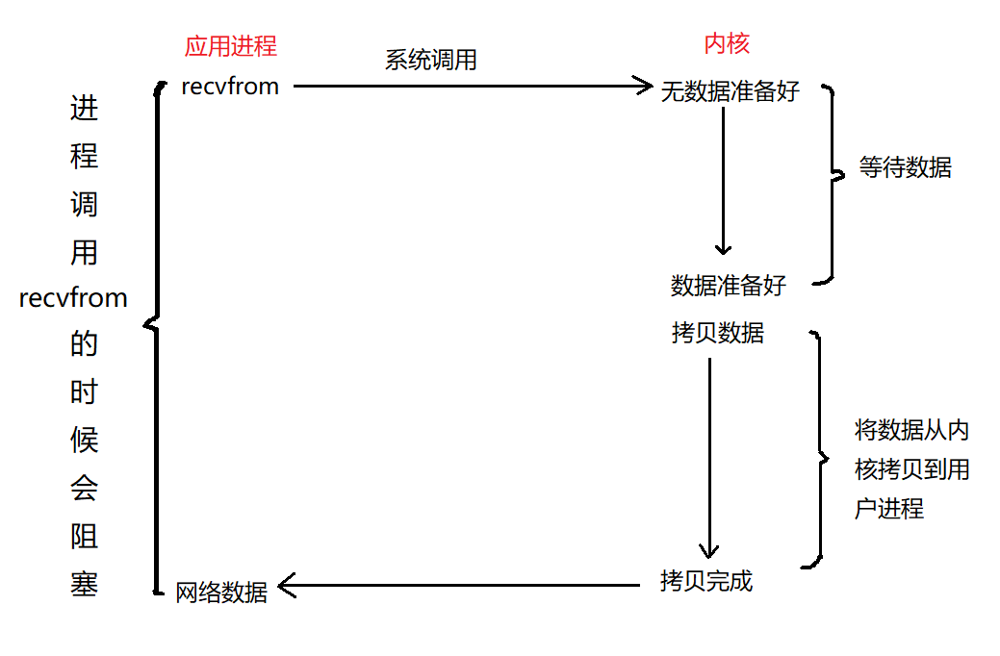
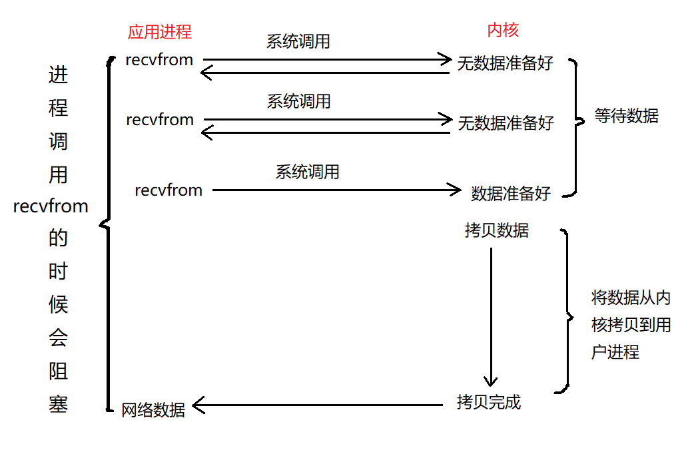
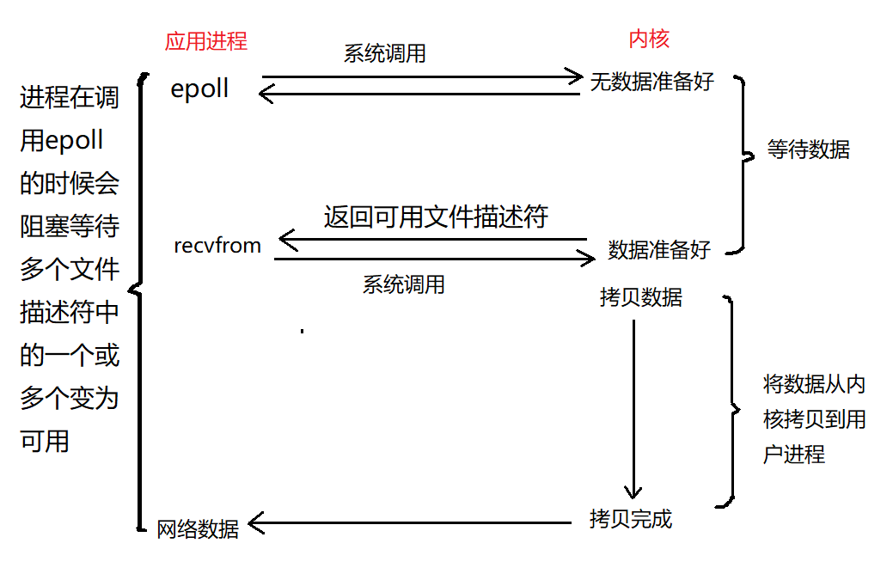
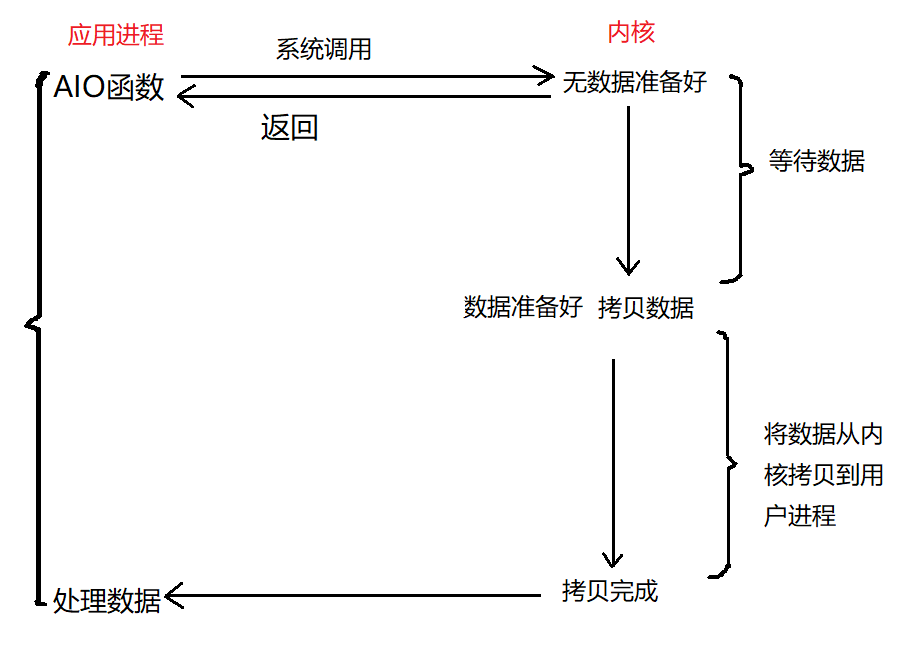

## 相关概念

在介绍 `I/O` 模型之前，我们要首先要知道什么是 `I/O`？
`I/O` 是 `Input/Output` 的缩写，指操作系统中的输入输出操作，从网络中获取或者发送数据也属于 `I/O` 操作的一种。
我们以网络数据为例看一下整个 `I/O` 的流程：

我们从图中可以看到，其实整个过程分为两步： 
1. 内核等待网络数据
2. 用户进程将数据从内核缓冲区中读取出来

在 `Linux` 中，分了五种 `I/O` 模型，如下图所示：

## 阻塞 I/O

用户进程调用 `recvfrom` 函数获取数据，这个时候如果内核没有数据，那么用户进程会一直阻塞在等待数据阶段，
直到数据准备好之后，将数据从内核缓冲区中拷贝到用户缓冲区中。在等待数据的时候，因为用户进程是阻塞的，所以不能做其他的事情

这就好比你去餐厅吃饭，你一直在后厨等着，知道你的饭菜做好之后才去饭桌吃饭。在等待的期间，你什么事情都不能干

## 非阻塞 I/O

用户进程通过 `recvfrom` 从内核获取数据的时候，如果内核的数据没有准备好，用户进程就直接返回，
去干别的事情，过一会儿重新调用 `recvfrom`，直到内核数据准备好。

还是以餐厅就餐为例： 
我： 服务员，你好，请问我点的餐好了吗？ 
服务员： 先生，您的餐还没有准备好，请稍等。 
… 五分钟后… 
我： 服务员，你好，请问我点的餐好了吗？ 
服务员： 先生，您的餐马上就好  
… 五分钟后…  
我： 服务员，你好，请问我点的餐好了吗？ 
服务员： 先生，您的餐已经做好了，现在就给您取过来。 

每次我问完服务员之后，如果餐尚未做好，我就可以干其他的事情了，比如看会手机，抽支烟，等过几分钟再问一次，直到餐品做好为止

## I/O 多路复用

这里还是以餐厅的场景为例，大家想一下我们平时去餐厅，每个餐厅的服务员数量和顾客数量哪个更多呢？

答案是显而易见的，肯定是顾客数量多啊。那么这是为啥呢，为什么不为每一个顾客安排一位服务员呢？
因为给每一位顾客分配一位服务员的人工成本太高了。

当然，还有一个原因就是：在某一个时间段内，并不是所有的顾客都需要服务员，只是部分顾客才需要，
所以我们并不需要为每一个顾客安排一个服务员。

在操作系统中也有同样的机制，同时监控很多个 `I/O` 操作，当一个 `I/O` 的数据准备好之后，就进行数据的拷贝.

我们对比一下 `I/O` 多路复用和餐厅的例子：

`epoll` 函数就相当于服务员；

一个 `I/O` 操作就相当于一个顾客；

每个服务员服务很多个顾客，对应于一个 `epoll` 监控多个 `I/O` 操作；

如果同时有多个顾客有需求，就对应于同时有多个 `I/O` 的数据准备好了，这时候服务员要逐个的帮助顾客解决问题，
同样的，操作系统也是逐个的处理每个 `I/O`。

讲到这里，大家应该就明白什么是 `I/O` 多路复用了吧，其实就是同时监控多个 `I/O` 操作。

`Nginx` 就是使用了 `I/O` 多路复用，所以能够达到非常高的并发量。

## 异步 I/O

我们仍然以餐厅的场景为例来说明异步 `I/O` 的过程。

服务员告诉我还要再等一会儿，因为我的餐品还没有完成。这一次呢，我给服务员留了一个电话，当餐备齐之后，
让他给我打电话。这个中间呢，我可以出去干其他事情，不用一直在后厨等，也不用时不时的去问一下，这就是异步过程

我们看一下上面这张图：当应用进程使用 `AIO` 函数从内核获取数据，这个时候内核中的数据还没有准备好，
但是 `AIO` 直接返回了，剩下的工作全部由内核进行完成。在这个过程中，应用进程可以做自己的事情

## 信号驱动

> 这个形式的 I/O 很少使用，大家不必过多关注

**`Nginx` 使用了 `epoll`，实现了 `I/O` 多路复用**

## select 和 epoll 的区别

`select` 和 `epoll`，这两个函数都是 `Linux` 提供的系统调用，用于完成 `I/O` 多路复用;
`select` 是早期的 `Linux`系统用于 `I/O` 多路复用的一个函数。默认情况下，它可以监控 1024 个 `I/O`；
`epoll` 是新版 `Linux` 提供的 `I/O` 多路复用的系统函数，解决 `select` 的一些缺点

`select`函数之后，程序要遍历所有的 `I/O`，而 `epoll` 只需要遍历准备好的 `I/O`

比如我们监控了 1000 个`I/O`，但是同一时间只有两个`I/O`准备好了。这个时候如果使用`select`函数的话，
我们要遍历这 1000 个`I/O`，找到准备好的 `I/O`，然后进行相应的操作。
而对于`epoll`的话，直接就会返回准备好的 `I/O`，我们只需要处理这两个 `I/O`就行了。如果同时监控大量`I/O`的话，效率差别就特别明显了