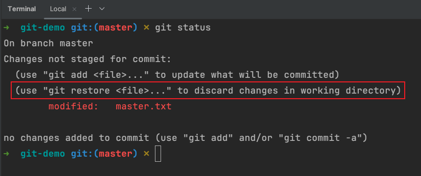
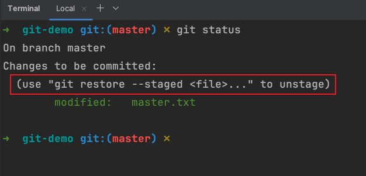
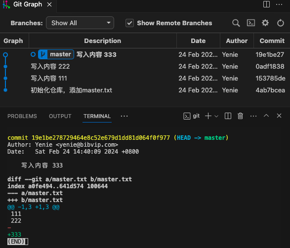
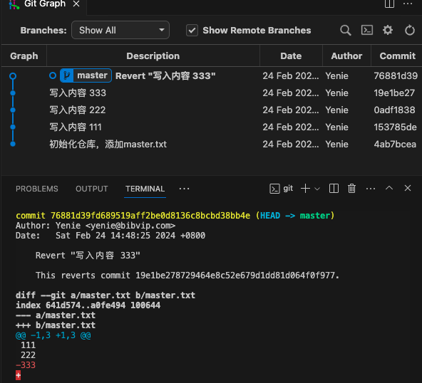
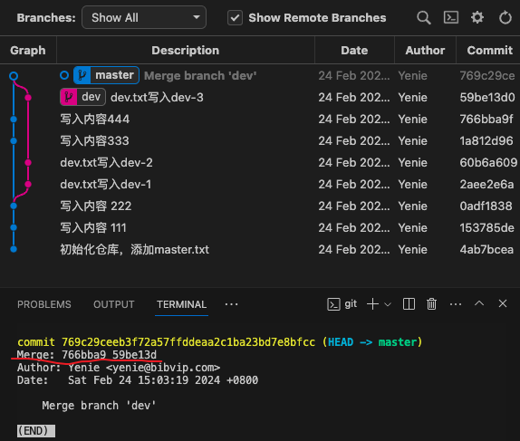
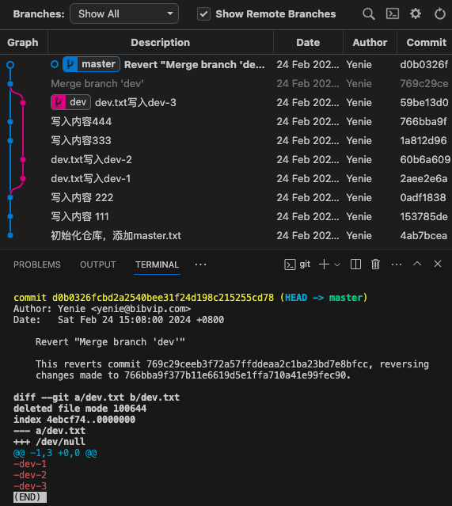

## 未提交

如果只是改了工作区代码，没有执行`git add`添加到暂存区，那么执行 `git restore .` 即可撤销所有更改；
一般IDE也会有 `Rollback`或者`Discard Changes`之类的界面操作

如果已经执行了`git add`将代码添加到了暂存区，那么需要加上`--staged`参数，即`git restore --staged .`，当前工作区不受影响

## 已生成commit

`git reset --hard`，会重置当前工作区和暂存区，使得保持和版本库中代码一致，所以未commit的代码会丢失

`git reset --mixed`，`--mixed` 是默认参数可省略，它会重置暂存区保留工作区内容；其实和上面`git restore --staged .`效果是一样的

`git reset --soft`，不怎么常用，有兴趣可以自行研究

## 已push到远程

这时需要使用 **revert** 命令撤销指定的提交内容，然后会生成新的commit；

但是有两种情况，一种是常规commit，只有一个**parent commit**，分支图看起来是一条直线，使用`git show HEAD`查看

然后执行`git revert HEAD`，输入commit信息，可以看到 **333** 已被撤销

另一种是 **merge commit**，合并分支后，新的commit会有两个**parent commit**，使用`git show HEAD`查看

然后执行`git revert -m 1 HEAD`，输入提交信息，再次查看发现dev分支内容已被撤销

最后解释下上面的命令，`-m 1`意思是保留哪个分支，1就是master分支，2就是dev分支，1和2的顺序对应`git show HEAD`看到的顺序(上图红线处)

