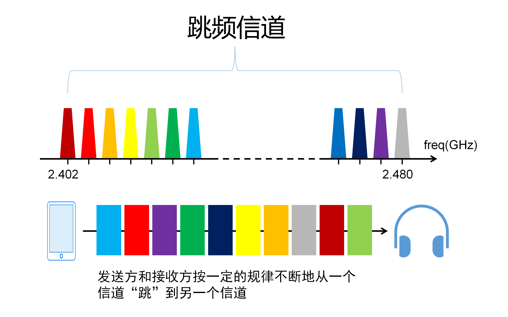

# 无线通信大比拼：Wi-Fi、蓝牙和NFC三巨头

在当今数字化飞速发展的时代，我们身边充斥着各种无线通信技术，它们如同无形的纽带，
将设备、人与人之间连接在一起。而其中的三位主角——Wi-Fi、蓝牙和NFC，正是无线通信领域的明星选手，各自擅长不同的舞台，各有千秋。

随着智能家居、物联网和移动支付等领域的蓬勃发展，Wi-Fi、蓝牙和NFC已经成为我们日常生活中不可或缺的存在。
那么，这三者究竟有何异同，各自又有哪些独特之处呢？本文就带着大家好好了解一下这三种技术。

## WIFI

Wi-Fi（Wireless Fidelity），又称作“移动热点”，是一种无线局域网技术，允许设备通过无线信号进行互联。
WIFI的出现极大地改变了人们对于互联网和网络连接的认知， 成为现代社会不可或缺的一部分。

Wi-Fi技术是把有线网络信号转换成无线信号，形成无线局域网，将局域网内的设备联网。

WIFI技术起源于20世纪90年代，最初由IEEE（电气和电子工程师协会）提出，用于简化设备之间的连接。最早的WIFI标准是802.11，
而后续的版本不断推出，如802.11a、802.11b、802.11g、802.11n、802.11ac和802.11ax。每个版本都引入了新的技术和性能提升，
满足了不同应用场景的需求。

WIFI技术基于无线电波进行通信，使用2.4GHz和5GHz频段。设备通过WIFI芯片发送和接收数据包，
使用CSMA/CA（载波监听多路访问/碰撞避免）协议来协调多个设备之间的通信。不同版本的WIFI标准支持不同的最大传输速率，从几Mbps到几Gbps不等。

### 不同WIFI标准的比较

- 802.11a：首个支持5GHz频段的WIFI标准，提供更高的传输速率。
- 802.11b：采用2.4GHz频段，较大的覆盖范围，但速率较低。
- 802.11g：在2.4GHz频段上提高了速率，向下兼容802.11b。
- 802.11n：引入多天线技术（MIMO），提升覆盖范围和传输速率。
- 802.11ac：运用更广泛的5GHz频段，实现更高速率和更大容量。
- 802.11ax：强调高密度环境下的性能和效率，支持更多设备同时连接。

### WIFI的安全性

WIFI网络的安全性一直备受关注，特别是在公共网络中。采取适当的安全措施是至关重要的：

- 加密方式： 使用WPA3（Wi-Fi Protected Access 3）等高级加密方式保护网络通信。
- 密码设置： 设置强密码，并定期更改，防止未经授权的访问。
- 防火墙： 在网络中使用防火墙，限制不必要的数据流量。

## 蓝牙

蓝牙技术是一种短距离无线通信技术，旨在实现设备之间的便捷连接和数据传输。蓝牙的发展历程跨足多个阶段，每个阶段都带来了新的特性和改进。

蓝牙技术最早于1994年由瑞典的爱立信公司提出，其名称源自10世纪丹麦国王哈拉尔德·布鲁图。最初版本的蓝牙技术主要用于连接手机和耳机，
随着技术的不断发展，蓝牙已经演变为一个多功能、广泛应用的无线通信标准。

蓝牙的实质是为固定设备或移动设备之间的通信环境建立通用的近距离无线接口，将通信技术与计算机技术结合起来，
使各种设备在没有电线或电缆相互连接的情况下，能在近距离范围内实现相互通信。

蓝牙技术使用短波无线电信号在设备之间进行通信。它采用频率跳跃技术（Frequency Hopping Spread Spectrum, FHSS）来减少干扰，
允许设备在不同频率上跳跃，提高通信的稳定性。蓝牙的通信范围通常为几米至十几米，适用于近距离通信场景。

跳频技术是把频带分成若干个跳频信道，在一次连接中，无线电收发器按一定的规律不断地从一个信道“跳”到另一个信道。
只有收发双方是按这个规律进行通信，其他的信号不可能按同样的规律进行干扰，所以蓝牙的安全性和抗干扰能力强。

### 蓝牙的不同版本

- 蓝牙1.x： 首个版本，用于音频设备的连接。
- 蓝牙2.x： 引入了更高的传输速率和增强数据同步功能。
- 蓝牙3.x： 提升了传输速率和能效，引入了高速蓝牙（HSB）。
- 蓝牙4.x： 引入低功耗蓝牙（BLE），广泛用于物联网设备。
- 蓝牙5.x： 提供更远的通信距离、更高的传输速率和更强大的广播功能。

### 蓝牙的发展趋势

未来蓝牙技术将面临更多的创新和发展：

- Mesh网络： 蓝牙Mesh网络使得多个设备能够相互通信，扩展了蓝牙的应用范围。
- 低功耗蓝牙（BLE）： 在物联网领域，BLE将继续发挥关键作用，支持低功耗设备的长时间运行。
- 高速蓝牙（HSB）： 针对需要更高速率的应用，如高清音频、视频传输等。

## NFC

近场通信（NFC）技术是一种短距离无线通信技术，允许设备之间进行快速、安全的数据传输。NFC在智能手机和其他设备中得到广泛应用，为用户提供了更便捷的互联体验。

NFC技术最早于20世纪80年代提出，但直到近年来才在智能手机和其他设备中得到广泛应用。NFC的发展始于RFID（射频识别）技术，
逐渐演变为一种支持更多应用场景的通信技术。

NFC采用了双向的识别和连接，适合20cm距离内的通信，工作频率在13.56 MHz，传输速率可为106 kbit/s、212 kbit/s、424 kbit/s和848 kbit/s。

### NFC的工作模式

NFC技术包括卡模式、读卡器模式和点对点模式：

- 卡模式： 设备可以像传统磁卡一样被读取，用于支付和身份验证。
- 读卡器模式： 设备可以读取其他NFC设备的信息，类似于扫描二维码。
- 点对点模式： 两个NFC设备之间可以直接进行数据交换，用于快速文件传输等。

### NFC的应用场景

NFC技术在多个领域得到广泛应用：

- 支付领域： NFC技术支持移动支付，用户可以通过手机或卡片进行快速支付。
- 身份验证： NFC卡片用于身份验证，如进入办公楼或公共交通工具。
- 智能标签： NFC标签被广泛用于商品标签、展览信息等，用户可通过手机轻松获取相关信息。
- 社交互动： NFC设备可以用于社交互动，例如两部手机通过NFC分享联系方式或社交媒体信息。

## 比较

WIFI、蓝牙和NFC是三种不同的无线通信技术，它们在多个方面有着明显的区别。

### 通信范围

- WIFI： 通常覆盖范围较广，可以达到数十米至数百米，具有较大的覆盖面积，适用于建立大范围网络。
- 蓝牙： 通信范围较短，一般在几米至十几米之间，更适合近距离设备互联。
- NFC： 最短的通信范围，通常在几厘米之内，需要设备之间非常接近才能进行通信。 

### 传输速率
- WIFI： 提供较高的传输速率，从几Mbps到数Gbps不等，适合大文件传输和高带宽需求的应用。
- 蓝牙： 传输速率中等，取决于使用的蓝牙版本，通常在数十Kbps到几百Mbps之间，适用于音频、视频和一般数据传输。
- NFC： 传输速率相对较低，一般在数十Kbps到几百Kbps，适用于小文件传输和简单的数据交换。 

### 应用场景
- WIFI： 主要应用于建立无线局域网络，用于互联网接入、大文件传输等，适用于家庭、企业和公共场所。
- 蓝牙： 适用于近距离设备互联，如耳机、音响、智能家居、医疗设备、汽车等。
- NFC： 主要用于快速、短距离的数据传输和交互，如移动支付、身份验证、社交互动等。

### 安全性
- WIFI： 提供多种加密和安全协议，但公共WIFI网络存在一定的安全风险，需要注意安全设置。
- 蓝牙： 提供安全特性，但存在一些潜在的安全漏洞，需要谨慎使用，尤其是在公共场所。
- NFC： 通过加密通信和短距离通信的特性，提供相对较高的安全性，适用于一些敏感领域的应用。

### 功耗
- WIFI： 消耗相对较大，适用于供电充足的设备。
- 蓝牙： 低功耗蓝牙（BLE）版本提供了较低的功耗，适用于长时间运行的设备。
- NFC： 功耗相对较低，适合在资源受限的设备上使用。

### 连接方式
- WIFI： 支持多设备同时连接，适用于构建大规模网络。
- 蓝牙： 支持点对点连接和星型连接，新版本的蓝牙支持Mesh网络，适用于设备之间灵活的连接。
- NFC： 主要用于一对一的点对点连接，适合快速数据传输和交互。

## 总结

Wi-Fi、蓝牙和NFC是三种不同的无线通信技术，各自适用于不同的应用场景，具有各自独特的优势和限制。选择使用哪种技术通常取决于具体的需求和环境。

- Wi-Fi（无线局域网）：适用于需要高速数据传输的场景，比如在家里或办公室中传输大量数据、流媒体等。Wi-Fi通常有较长的传输距离和高传输速率，
  但相对而言功耗较高。
- 蓝牙：适用于连接各种设备，例如耳机、键盘、鼠标等。蓝牙通常具有较低的功耗，适合短距离通信，但传输速率相对较低。
- NFC（近场通信）：适用于短距离的数据传输，常用于移动支付和身份识别等场景。NFC的传输距离相对较短，但由于其近场特性，更容易确保安全性。

根据具体需求选择合适的技术是很重要的，而且在实际应用中，这三种技术也可以互相补充。例如，在一个智能家居系统中，
可能同时使用Wi-Fi连接高带宽设备、蓝牙连接低功耗设备，以及NFC进行一些简单的配置或身份验证操作。